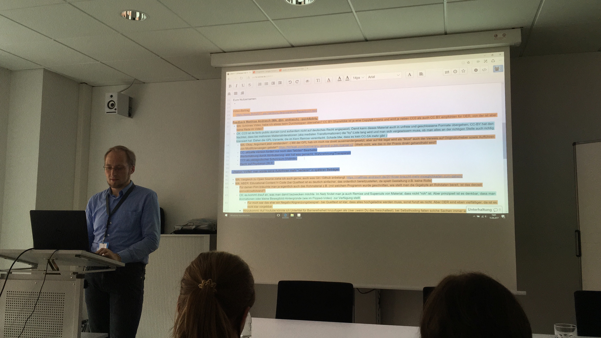
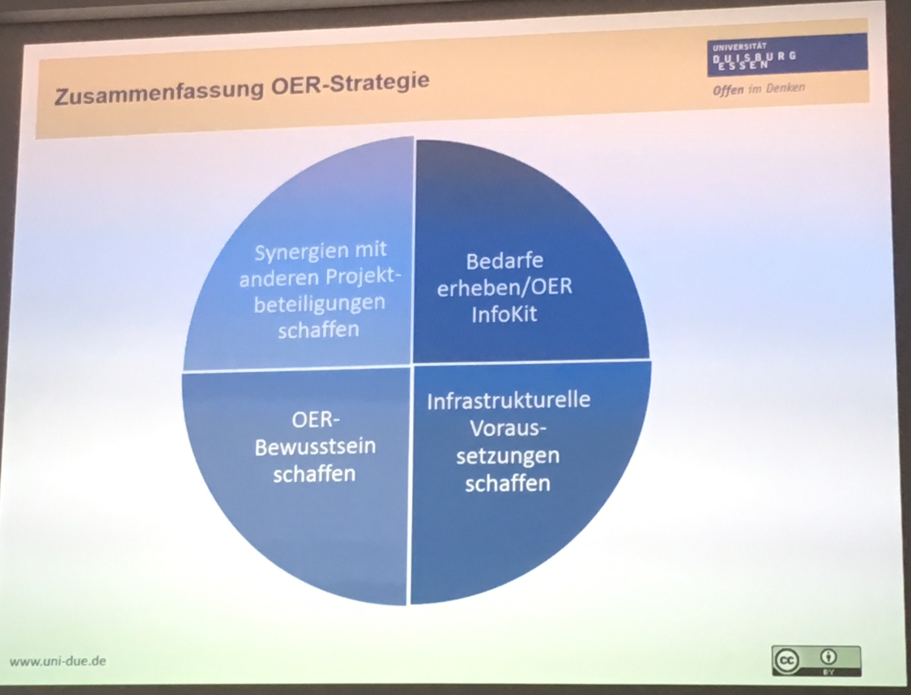
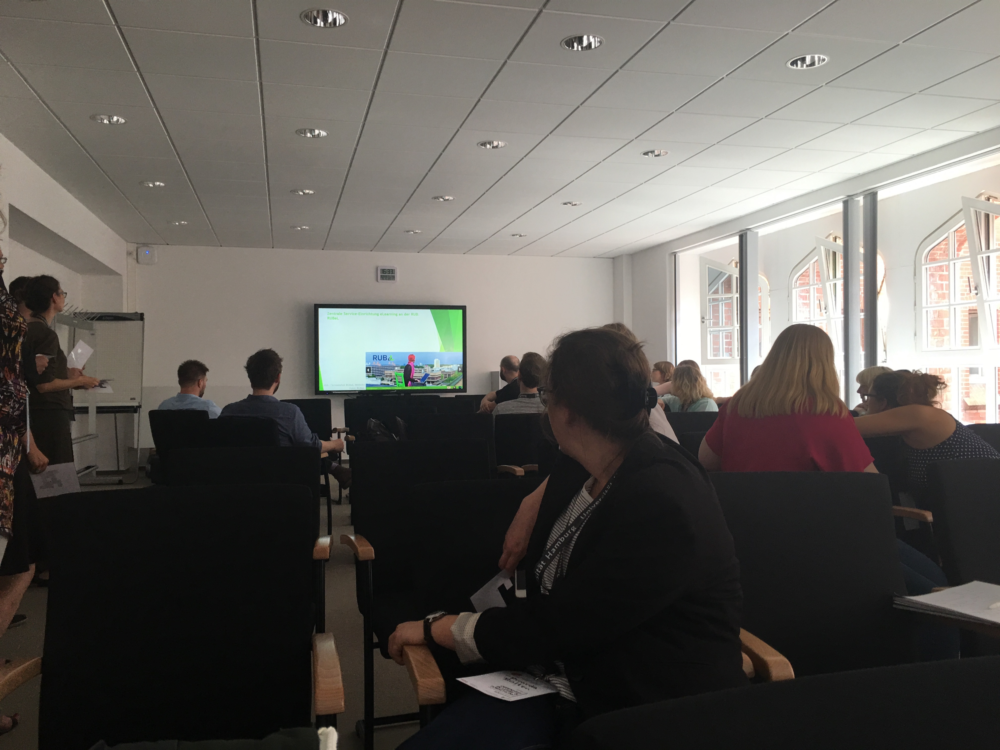
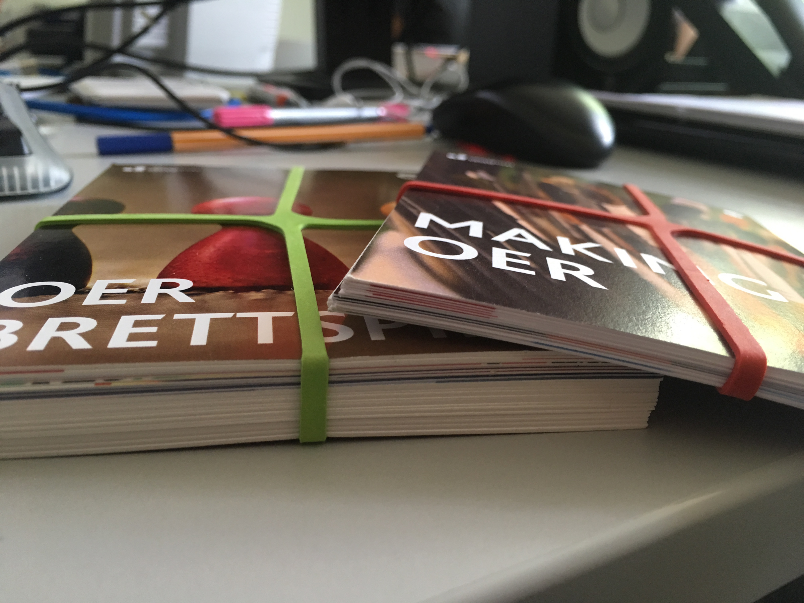

# JFMH 2017
 
Eine indivduelle Kurzdarstellung von @koenitz

+++
Das war btw. meine Ausgangslage:

Insofern war ich gespannt, welche Impulse entstehen würden. Und ich wurde positiv überrascht.
---

---

## [ AGENDA ]

 
### 1 Erkenntnisse
### 2 Tools
### 3 Sonstiges.</li>

---
# [ ERKENNTNISSE ]

+++
## OER sind ein ambivalentes Thema.
***
 
Debatte darum, ob OEP ein Teil von OER seien, oder etwas davon getrenntes.  
OER als Material |
OER als Mindset  
(thx @mayrberger)

+++
## OER als Strategie.
***
 
In einem guten Vortrag legte David Eickhoff die Strategie der Uni Duisburg Essen dar. Er ist Teil des Kerres'schen LearningLabs.   
OER als Strategie |
OER als Material |
OER als Mindset  
+++

+++
## OEP als diskursives Feld.
***
 
Spannender Workshop von @danderlan und @franziskalinke, in dem ich wieder gemerkt habe, wie viel Spaß es macht Forschungsgegenstände zu rekonstruieren. In diesem Fall über Tweets die OEP thematisieren.

+++
## Flipped Classroom ist noch nicht so richtig angekommen

Nur ein Bruchteil der TeilnehmerInnen hatten sich die Videos angeschaut.

+++
Partizipation im Etherpad war jedoch sehr gut (thx insb. @m_andrasch) und erkenntnisreich. 
####[Link zum Etherpad](https://pad.hs-wismar.de/p/jfmh17).

---
# [ TOOLS ]

+++
## VOSviewer
***
 
Freies Tool zur Visualisierung von Daten  
Cluster |
Heatmaps  
(thx @sozmethode)

+++
## GitBook und GitPitch
***
 
Produktive Szenarios für Text und Präsentationsdokumente (thx @xldrkp von der TUHH).  
Plädoyer für das Experimentieren und Ausprobieren von GitLab neben "klassischen" LMS-Anwendungen. Vorteil: Ermöglichung neuer mediendidaktischer Szenarien und Emergenz. [Link zur Keynote als Text](https://axel-duerkop.de/blog/2017/06/18/die-architektur-von-offenheit/).

+++
## Print hat auch noch eine Zukunft
***
Uni Siegen: Postkartenformat für allgemeine OER-Weiterbildung (thx @[Alexander Schnücker](http://hd.uni-siegen.de/oerhd/?lang=de) ).

---
# [ SONSTIGES ]
***

Was mir noch so auf- und eingefallen ist.

+++
## Vages
***
 
~QPL ist allgegenwärtig.~ <b>Die Blockchain ist allgegenwärtig.</b>    Zukunft ungewiss.

+++
## Open Science
***
 
Digital Methods müssen vor dem Hintergrund von Open Science sowie forschungsethischer Standpunkte betrachtet werden.

---

# ENDE DER VORSTELLUNG
